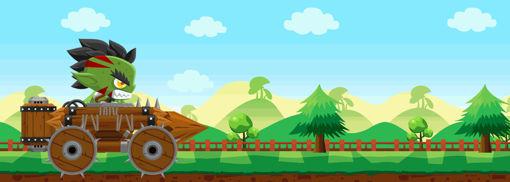

# Example

</a>

# SCSS - Animation Images
> เป็นการประยุกต์ใช้งาน SCSS โดยการเขียน Animation ให้กับไฟล์รูปภาพ 

### ลักษณะการทำงาน
นำภาพแต่ละส่วนมาเขียน CSS ประกอบกันให้เป็นรูปร่าง
แล้วเขียน Animation ให้แต่ละ Element

Credit รูปภาพ : http://www.gameart2d.com/hill-climb-racing---free-car-sprites.html
